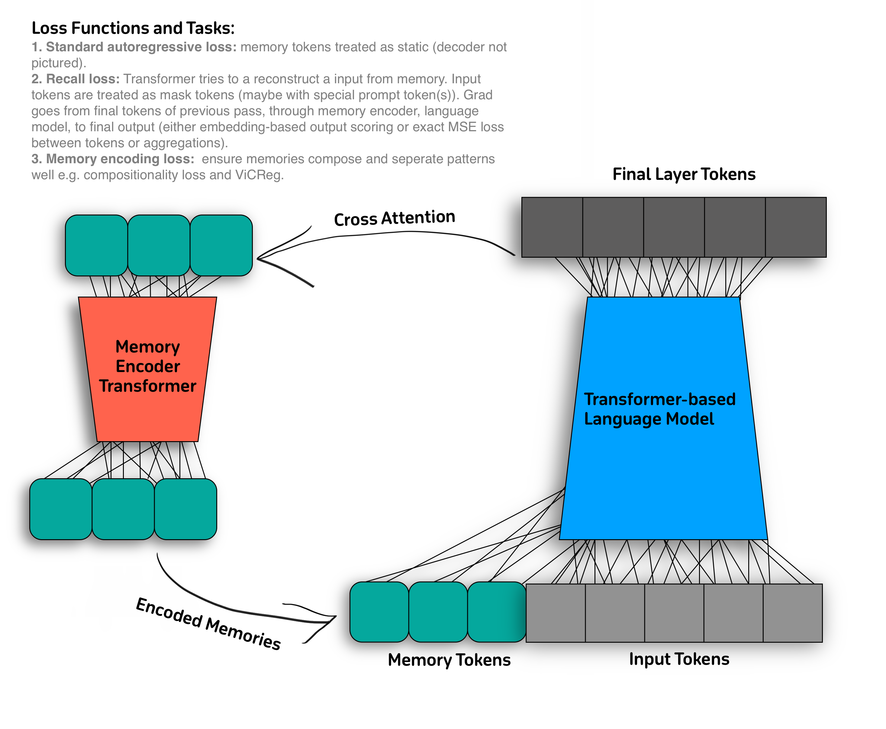

# Transformers with Memory
## Introduction

This repository will follow a framework like the [recurrent memory transformer](https://arxiv.org/pdf/2207.06881.pdf), though only loosely. In particular, this transformer will have two seperate modules: one conventional language model which has additional memory tokens and a seperate module that updates memory tokens between timesteps. The following figure shows the architecture of the model:

Elaborating, an issue with true recurrence (which follows from the loops above), is that it becomes unwieldy with backpropagation-through-time. Hence, this model will use seperate losses that ensure efficient use of memory, while avoiding recurrence. This is done by training the memory and language model seperately.

## The Loss Functions
The losses, mentioned in the image above, are as follows:

1. A conventional language model loss, e.g. next token prediction. The memory tokens will be just like regular input tokens here. This loss only acts on the language model.
2. Recall loss, a special task and corresponding loss where the model must use the memory tokens to reproduce the original input. This ensures the model knows how to use the memory tokens. This loss acts on both the language model and the memory transformer.
3. Pattern separation loss, a loss based on conventional studies of the hippocampus. This loss will be a self-supervised loss, like VICReg, acting on the memory transformer alone.